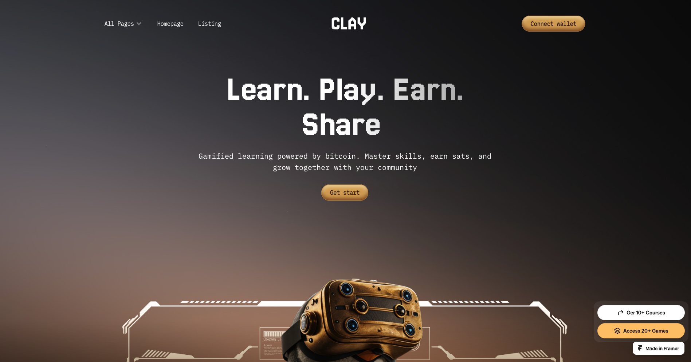

# Portfolio V1 🫡

A minimal, responsive developer portfolio built with React.js, TypeScript, and Tailwind CSS. It features smooth animations using Framer Motion and GSAP.

| Light Theme                                | Dark Theme                                |
| ------------------------------------------ | ----------------------------------------- |
|  |  |

### [Live Demo](https://n4ryn.com/)

## Features

- 💅 Clean and minimal design
- 💻 Fully responsive
- 🎨 Tailwind CSS
- 💨 Smooth animations using Framer Motion
- ↑ Custom cursor using GSAP
- 🎉 Customizable theme
- 📱 Mobile-first design
- 📦 Light and dark mode support
- 📝 TypeScript support

## Getting Started

To get started, follow these steps:

1. Clone the repository:

```bash
git clone https://github.com/n4ryn/portfolio-v1.git
```

2. Install dependencies:

```bash
npm install
```

3. Start the development server:

```bash
npm run dev
```

4. Open [http://localhost:5173](http://localhost:5173) in your browser to view the portfolio.

## Customization

You can customize the portfolio by modifying the following files:

- `src/constants/about.ts`: Define about yourself here.
- `src/constants/projects.ts`: Define your projects here.
- `src/constants/experience.ts`: Define your experiences here.
- `src/constants/socials.ts`: Define your social media links here.

## Contributing

Contributions are welcome! If you find any issues or have suggestions for improvements, please open an issue or submit a pull request on the GitHub repository.
